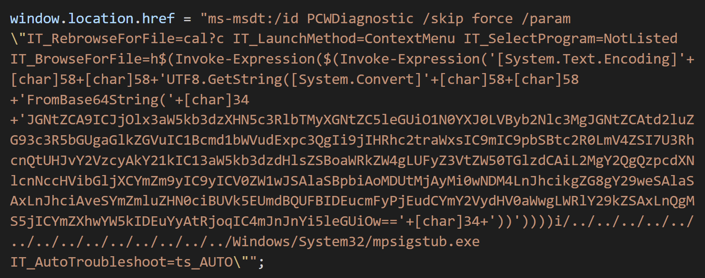

# Malware Analysis

## Obfuscated Scripts

One type of obfuscation used by malware authors is the use of Base64 encoding for Windows PowerShell and other scripting languages.

For example, in [CVE-2022-30190](https://www.bleepingcomputer.com/news/microsoft/microsoft-shares-mitigation-for-office-zero-day-exploited-in-attacks/), the creators used Base64 encoding to hide the dirty work:

<blockquote class="twitter-tweet">
Interesting maldoc was submitted from Belarus. It uses Word&#39;s external link to load the HTML and then uses the &quot;ms-msdt&quot; scheme to execute PowerShell code.<a href="https://t.co/hTdAfHOUx3">https://t.co/hTdAfHOUx3</a> <a href="https://t.co/rVSb02ZTwt">pic.twitter.com/rVSb02ZTwt</a>
&mdash; nao_sec (@nao_sec) <a href="https://twitter.com/nao_sec/status/1530196847679401984?ref_src=twsrc%5Etfw">May 27, 2022</a></blockquote>

Image was provided by security research team [nao_sec](https://nao-sec.org/). (As I'm writting this, a patch has not yet been released but a workaround involving deletion of a registry key to disable the vulnerable tool has been.)

There are a number of ways to decode Base64 encoded scripts, but one of the most popular is using [Cyberchef.com](https://gchq.github.io/CyberChef/). I highly recommend you become familiar with it. Along with the ability to decode obfuscated scripts (ie. base64, rot-13, etc.) it works great with decoding shellcode into x86 assembly instructions.

## Malicious Documents (maldocs)

* [Malicious Documents Workshop by Didier Stevens](https://www.youtube.com/watch?v=kk1KUEVtDgQ&ab_channel=dist67) - Part 1
* [Video by Didier Stevens on analyzing malicious OneNote files](https://youtu.be/PJ5oluVlEb8?si=ryrFQU6bLtC8QmW7)

## Malicious PDF Analysis

This link contains a number of videos put together by Didier Stevens explaining how to use his PDF analysis python scripts such as `pdfid.py` and `pdf-parser.py`. Definitely check out `make-pdf.py`.

* [Malicious PDF Analysis Workshop](https://www.youtube.com/playlist?list=PLa-ohdLO29_Y2FeT24w-c9nA_AH84MIpp)

## Shellcode in Maldocs

* [Shellcode Maldoc Triage by Cyber Yeti](https://www.youtube.com/watch?v=EoecZyNoL-k&ab_channel=DrJoshStroschein-TheCyberYeti) - A series. Slightly advanced. Requires basic understanding of shellcode/assembly and IDA.
* [sclauncher by Cyber Yeti](https://github.com/jstrosch/sclauncher) - Install `sclauncher` - a short C program to wrap shellcode into a PE to have it executable.
  Warning: This is likely a dangerous thing to do unless you know what shell code does.
  
  
## Online Analysis Platforms

* [Virus Total](https://www.virustotal.com/gui/home/search) - Aka VT: The premiere virus database online.
* [Intezer Analyze](https://analyze.intezer.com/) - Similar to Virus Total, uses VT as one of many sources.
* [Pandora](https://pandora.circl.lu/submit) - Website and Github project by [CIRCL](https://www.circl.lu/) - The Computer Incident Response Centre of Luxembourg
